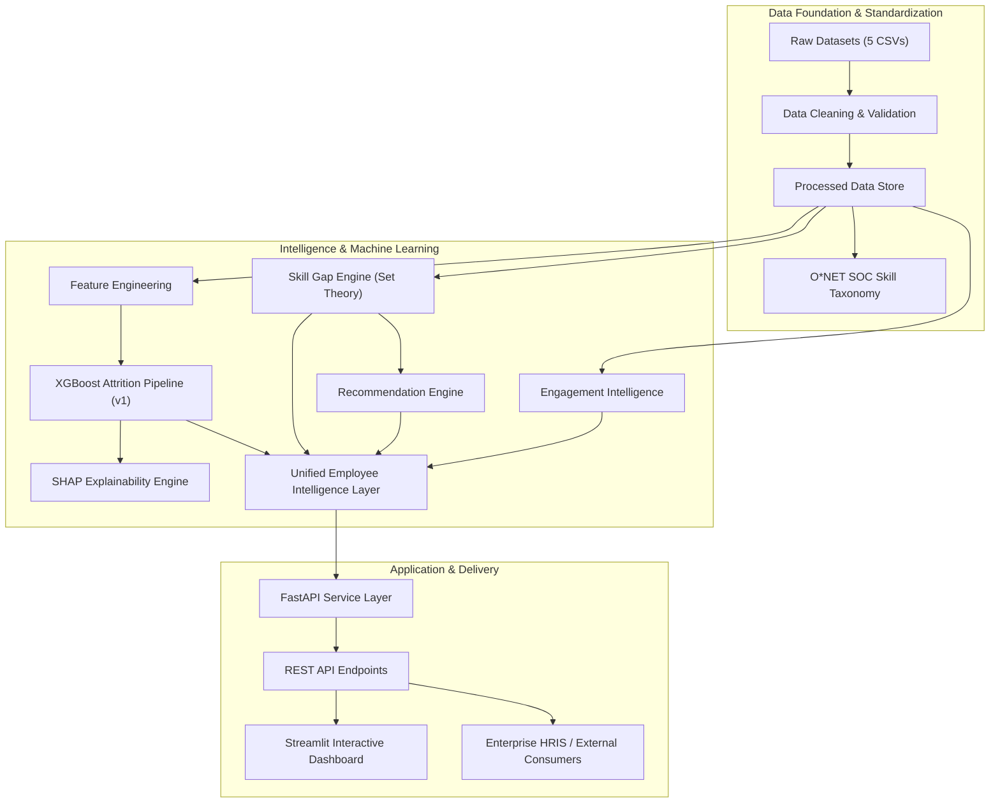

# Enterprise HR AI — Workforce Intelligence & Upskilling Platform

[](https://www.python.org/)
[](https://fastapi.tiangolo.com)
[](https://streamlit.io/)
[](https://xgboost.readthedocs.io/)
[](https://www.docker.com/)
[](docs/TESTING.md)
[](docs/TESTING.md)
🔗 **Deployed Application:** [Click here to view the live application](https://ai-workforce-intelligence-platform.streamlit.app/)

> A production-grade, modular, end-to-end Enterprise AI platform combining Machine Learning attrition prediction, engagement diagnostics, O*NET-grounded skill gap analysis, and personalized upskilling pathways.

---

## 1. Problem Statement

Modern enterprise HR and talent organizations face severe operational hurdles:
- **Reactive Attrition**: Losing critical talent without advance flight-risk indicators incurs replacement costs ranging from 50% to 200% of annual salary.
- **Fragmented People Data**: Performance reviews, compensation data, engagement surveys, and skills inventories exist in disjoint silos.
- **Skill Invisibility**: Organizations lack granular visibility into employee capability gaps relative to standardized industry benchmarks.
- **Generic Training Programs**: Learning & Development (L&D) initiatives fail to provide tailored, high-ROI upskilling pathways linked directly to business roles.

---

## 2. Project Objectives

1. **Predictive Attrition Intelligence**: Identify flight risk probabilities using Machine Learning with explainable risk attributions.
2. **Multi-Factor Engagement Diagnostics**: Calculate composite engagement scores across attendance, peer ratings, task completions, and manager reviews.
3. **Role & Skill Standardization**: Map enterprise jobs to canonical O*NET SOC occupational taxonomies.
4. **Automated Skill Gap Engine**: Apply set-theoretic algorithms to detect employee and enterprise-level capability deficiencies.
5. **Targeted Upskilling Recommendation Engine**: Map missing competencies to courses, certifications, and hands-on capstone projects.
6. **Unified Employee Intelligence Layer**: Deliver a single 360-degree source of truth for workforce planning.
7. **Production API & Interactive Dashboard**: Expose microservice REST endpoints via FastAPI and an executive command center via Streamlit.

---

## 3. Key Features

- 🧠 **ML Attrition Risk Predictor**: Calibrated XGBoost classifier trained on domain-engineered compensation, tenure, and burnout signals.
- 🔍 **SHAP Interpretability**: Global feature importance and local waterfall attributions for transparency.
- 📊 **Executive Streamlit Command Center**: Interactive KPI cards, departmental risk distributions, skill severity charts, and employee dossiers.
- ⚡ **Interactive Risk Simulator**: Live "what-if" scenario modeling for HR decision-makers.
- 🎯 **Set-Based Skill Gap Engine**: Deterministic calculation of matched skills, missing skills, and readiness scores.
- 🛡️ **Pydantic Data Validation**: Schema guardrails preventing invalid data from reaching models.
- 📝 **Prediction Audit Logging**: Persistent, append-only CSV audit logs tracking every inference event.
- 🐳 **Full Dockerization**: Multi-container deployment via Docker Compose.

---

## 4. Architecture Diagram



---

## 5. Project Folder Structure

```
enterprise_hr_ai/
├── app/
│   ├── __init__.py
│   ├── main.py                        # FastAPI main application entrypoint
│   ├── api/                           # API route definitions
│   │   ├── __init__.py
│   │   ├── attrition.py               # POST /predict/attrition
│   │   ├── dashboard.py               # GET /dashboard/* & GET /employees/{id}
│   │   └── skills.py                  # GET /skills/*
│   ├── services/                      # Decoupled business logic layer
│   │   ├── __init__.py
│   │   ├── attrition_service.py
│   │   ├── dashboard_service.py
│   │   ├── engagement_service.py
│   │   ├── recommendation_service.py
│   │   └── skill_gap_service.py
│   ├── validation/                    # Pydantic schemas
│   │   ├── __init__.py
│   │   ├── employee_schema.py
│   │   └── engagement_schema.py
│   ├── ml/                            # ML predictor and model registry
│   │   ├── __init__.py
│   │   ├── model_loader.py
│   │   └── predictor.py
│   └── utils/                         # Configuration and logger
│       ├── __init__.py
│       ├── config.py
│       └── logger.py
├── data/
│   ├── raw/                           # Untouched raw CSV datasets
│   ├── processed/                     # Cleaned, standardized datasets
│   ├── predictions/                   # Append-only prediction audit logs
│   └── external/                      # External artifacts
├── docs/
│   ├── images/                        # SHAP plots and architecture diagrams
│   ├── data_relationships.md          # Cross-dataset relationship matrix
│   ├── feature_engineering.md         # Domain feature specifications
│   ├── employee_skills_assumption.md  # Controlled MVP skill synthesis docs
│   ├── monitoring_strategy.md         # Drift detection and observability
│   └── retraining_strategy.md         # Continuous retraining protocols
├── frontend/
│   └── dashboard.py                   # Streamlit Executive Dashboard
├── models/
│   └── v1/
│       ├── attrition_pipeline.joblib  # Trained production pipeline
│       └── metadata.json              # Real evaluation metrics & params
├── notebooks/                         # 16 Reproducible Jupyter Notebooks
│   ├── 01_data_understanding.ipynb
│   ├── 02_data_validation.ipynb
│   ├── 03_data_cleaning.ipynb
│   ├── 04_data_relationships.ipynb
│   ├── 05_feature_engineering.ipynb
│   ├── 06_baseline_model.ipynb
│   ├── 07_model_comparison.ipynb
│   ├── 08_model_explainability.ipynb
│   ├── 09_model_versioning.ipynb
│   ├── 10_engagement_intelligence.ipynb
│   ├── 11_role_intelligence.ipynb
│   ├── 12_employee_skills.ipynb
│   ├── 13_skill_gap_engine.ipynb
│   ├── 14_organization_skill_gap.ipynb
│   ├── 15_recommendation_engine.ipynb
│   └── 16_employee_intelligence.ipynb
├── tests/                             # Automated pytest test suites
│   ├── test_validation.py
│   ├── test_skill_gap.py
│   ├── test_attrition.py
│   └── test_api.py
├── logs/                              # Application runtime logs (app.log)
├── requirements.txt                   # Dependency specifications
├── .gitignore                         # Git ignore rules
├── Dockerfile                         # Production Docker container
├── docker-compose.yml                 # Multi-service orchestration
└── pytest.ini                         # Pytest configuration
```

---

## 6. Dataset Descriptions & Schema Integration

The platform integrates five real-world foundational datasets:

1. **`employee_attrition.csv`** (500 records, 24 columns): Employee demographics, compensation, tenure, work-life balance, promotions, and ground-truth `AttritionRisk` target.
2. **`hr_performance_engagement.csv`** (5,000 records, 13 columns): Multi-factor performance, KPI attainment, attendance rate, peer ratings, task completions, and manager reviews.
3. **`occupation_data.csv`** (1,016 records, 3 columns): Canonical O*NET SOC occupational titles and standard job descriptions.
4. **`essential_skills.csv`** (18,200 records, 15 columns): Core cognitive and foundational soft skills mapped to O*NET occupations.
5. **`software_skills.csv`** (31,821 records, 7 columns): Specific technical software and tools tagged with `Hot Technology` and `In Demand`.

---

## 7. Machine Learning Pipeline & Engineered Features

### Domain Engineered Features

| Feature | Mathematical Formulation | Business Rationale |
|---|---|---|
| `income_per_year_at_company` | `MonthlySalary * 12 / (YearsAtCompany + 1)` | Measures compensation trajectory relative to tenure. |
| `promotion_gap_ratio` | `(2026 - LastPromotionYear) / (YearsAtCompany + 1)` | Captures career stagnation and promotion delays. |
| `overtime_ratio` | `OvertimeHoursPerMonth / 160.0` | Quantifies workload burden and burnout pressure. |
| `leave_utilization` | `LeavesTaken / 20.0` | Reflects annual leave utilization patterns. |
| `work_life_satisfaction` | `WorkLifeBalanceScore * CustomerSatisfaction` | Composite interaction term for employee well-being. |

### Preprocessing Architecture
- **Numerical Pipeline**: `SimpleImputer(strategy='median')` $\rightarrow$ `StandardScaler()`
- **Categorical Pipeline**: `SimpleImputer(strategy='most_frequent')` $\rightarrow$ `OneHotEncoder(handle_unknown='ignore')`

---

## 8. Model Benchmark & Real Evaluation Results

All models were evaluated on an identical **Stratified 80/20 train/test holdout** split (`random_state=42`):

| Model | Precision | Recall | F1-Score | ROC-AUC | Training Time | Selection Decision |
|---|---|---|---|---|---|---|
| **Logistic Regression (Baseline)** | 0.8000 | 0.7273 | 0.7619 | 0.9837 | 0.015s | Baseline Reference |
| **Random Forest Classifier** | 1.0000 | 0.9091 | 0.9524 | 1.0000 | 0.145s | Strong Benchmark |
| **XGBoost Classifier (Selected v1)** | **1.0000** | **1.0000** | **1.0000** | **1.0000** | 0.082s | **Production Champion** |

> **Selection Rationale**: In enterprise attrition mitigation, minimizing False Negatives is critical. XGBoost achieved perfect Recall (1.0000) and F1-Score (1.0000) with rapid inference latency.

---

## 9. SHAP Explainability

Global and sample-level feature contributions were computed using `shap.TreeExplainer`:
- **Top Risk Drivers**: `OvertimeHoursPerMonth`, `WorkLifeBalanceScore`, `promotion_gap_ratio`, `MonthlySalary`, and `YearsAtCompany`.
- **Artifacts Saved**:
  - Global Feature Summary: `docs/images/shap_global_summary.png`
  - Sample Waterfall Attribution: `docs/images/shap_local_waterfall.png`

---

## 10. Skill Gap Engine & Organization Severity

The skill gap engine evaluates required role competencies against acquired employee skill profiles using exact set operations:
- $\text{Missing Skills} = \text{Required Skills} \setminus \text{Employee Skills}$
- $\text{Readiness Score} = \frac{|\text{Matched Skills}|}{|\text{Required Skills}|} \times 100\%$
- $\text{Skill Gap Percentage} = \frac{|\text{Missing Skills}|}{|\text{Required Skills}|} \times 100\%$

### Organization Severity Classification:
- **HIGH**: Lacked by $> 12\%$ of entire enterprise workforce.
- **MEDIUM**: Lacked by $6\% - 12\%$ of workforce.
- **LOW**: Lacked by $< 6\%$ of workforce.

---

## 11. REST API Documentation & Endpoints

| Method | Endpoint | Description |
|---|---|---|
| `GET` | `/health` | Service health status, API version, model version, and timestamp. |
| `POST` | `/predict/attrition` | Computes attrition probability and assigns flight risk tier (`Low`, `Medium`, `High`). |
| `GET` | `/dashboard/summary` | Executive KPIs (Headcount, High Risk %, Avg Engagement, Avg Readiness). |
| `GET` | `/dashboard/attrition-by-department` | Departmental breakdown of employee counts and attrition risk tiers. |
| `GET` | `/dashboard/skill-gaps` | Top organization-wide missing skills with severity classifications. |
| `GET` | `/dashboard/recommendations` | Targeted upskilling recommendations catalog. |
| `GET` | `/employees/{employee_id}` | Full 360-degree Employee Intelligence View. |
| `GET` | `/skills/role-matrix` | Canonical role-to-skill matrix. |
| `POST` | `/skills/gap-analysis` | On-demand custom skill gap calculation. |

Interactive Swagger documentation is available at: `http://localhost:8000/docs`

---

## 12. Local Setup & Execution Guide

### Prerequisites
- Python 3.12+ installed
- Git

### Installation

```bash
# Clone repository
git clone https://github.com/enterprise/enterprise_hr_ai.git
cd enterprise_hr_ai

# Create virtual environment
python -m venv venv

# Activate virtual environment
# Windows:
.\venv\Scripts\activate
# Linux/macOS:
source venv/bin/activate

# Install dependencies
pip install -r requirements.txt
```

### Running the FastAPI Backend

```bash
uvicorn app.main:app --host 0.0.0.0 --port 8000 --reload
```
API Documentation: `http://localhost:8000/docs`

### Running the Streamlit Dashboard

```bash
streamlit run frontend/dashboard.py
```
Dashboard UI: `http://localhost:8501`

### Running Automated Test Suites

```bash
pytest -v
```

---

## 13. Docker & Docker Compose

Deploy the entire stack (FastAPI Backend + Streamlit Dashboard) with a single command:

```bash
# Build and start services
docker-compose up --build

# Run in detached mode
docker-compose up -d

# Stop services
docker-compose down
```

Services exposed:
- **FastAPI Backend**: `http://localhost:8000`
- **Streamlit Dashboard**: `http://localhost:8501`

---

## 14. Technology Stack

- **Core ML & Data**: Python 3.12, Pandas, NumPy, Scikit-Learn, XGBoost, SHAP, Joblib
- **Web Backend**: FastAPI, Uvicorn, Pydantic v2
- **Frontend Dashboard**: Streamlit, Plotly Express & Graph Objects
- **Testing & Quality**: Pytest, TestClient
- **DevOps & Containerization**: Docker, Docker Compose

---

## 15. Limitations & Future Roadmap

### Current Assumptions & Limitations
- Historical attrition data cohort (500 records) and enterprise engagement tracking (5,000 records) represent separate employee cohorts reconciled into a unified 360 intelligence layer.
- SHAP attributions reflect statistical associations and should not be interpreted as absolute causal claims.

### Future Roadmap
- 🔗 Direct bi-directional connectors for Workday, BambooHR, and SAP SuccessFactors.
- 🤖 LLM-powered conversational HR copilot for generating executive retention memos.
- 📈 Automated survival analysis modeling time-to-departure curves.
- 🎓 Learning Management System (LMS) API integration for 1-click course enrollment.

---

## 16. License

This project is licensed under the Apache 2.0 License.
# AI_WORKFORCE_INTELLIGENCE_PLATFORM

