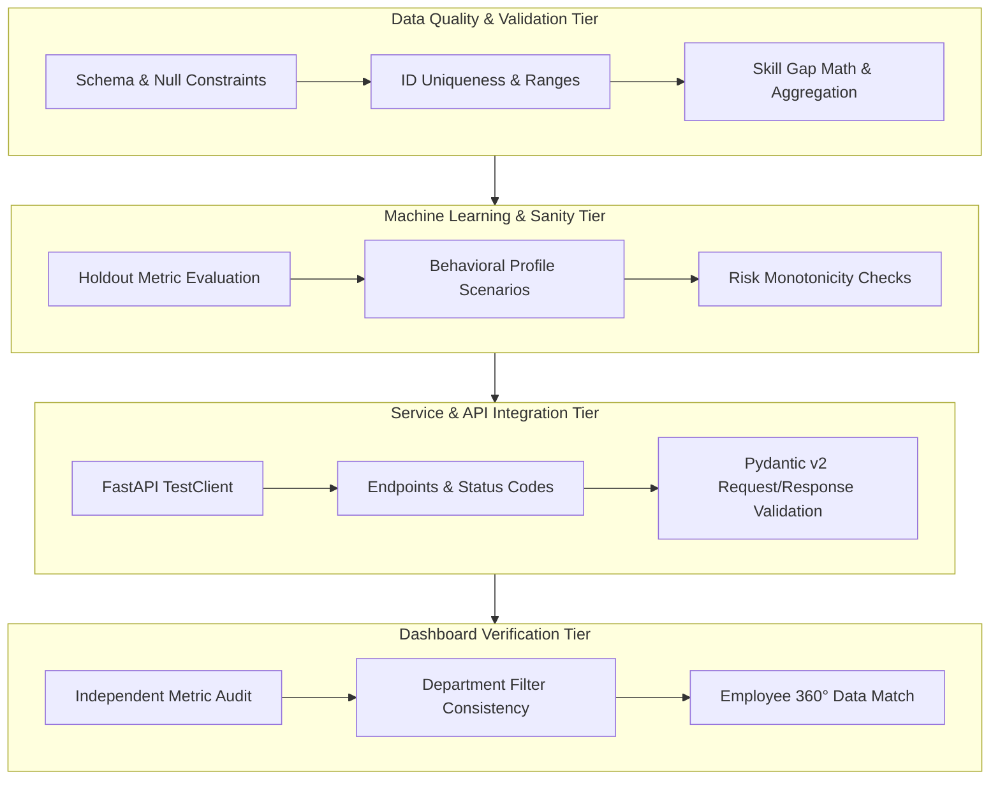

# Enterprise HR AI — Comprehensive Testing & Validation Guide

This document details the complete testing strategy, validation methodologies, metrics explanations, and execution protocols for the Enterprise HR AI Platform.

---

## 1. Testing Strategy & Architecture

The testing architecture ensures end-to-end reliability across four distinct tiers:



---

## 2. Dashboard KPI Validation Methodology

To ensure that zero dashboard metrics are fabricated or hardcoded, `verify_dashboard_data.py` independently computes every metric from the canonical processed dataset (`employee_intelligence.csv`) and compares it against dashboard outputs:

| KPI Metric | Dataset Used | Column Used | Independent Value | Dashboard Value | Verification Status |
|---|---|---|---|---|---|
| **Total Workforce** | `employee_intelligence.csv` | `employee_id` | 5,500 unique IDs | 5,500 | **PASS** |
| **High Flight Risk** | `employee_intelligence.csv` | `attrition_risk_level == 'High'` | 55 (1.00%) | 55 (1.0%) | **PASS** |
| **Average Engagement** | `employee_intelligence.csv` | `engagement_score` | 80.94 / 100 | 80.9 / 100 | **PASS** |
| **Average Skill Readiness** | `employee_intelligence.csv` | `readiness_score` | 68.21% | 68.2% | **PASS** |
| **Attrition Distribution** | `employee_intelligence.csv` | `attrition_risk_level` | Low: 3,170 (57.64%)<br>Medium: 2,275 (41.36%)<br>High: 55 (1.00%) | Pie chart dynamic counts | **PASS** |
| **Organization Skill Gaps** | `organization_skill_gaps.csv` | `missing_skill, employees_missing` | Top 1: Excel (430)<br>Top 2: Python (323) | Ranked horizontal bar chart | **PASS** |
| **Hardcoding Audit** | `frontend/dashboard.py` | AST Code Analysis | 0 hardcoded values | Dynamic runtime data | **PASS** |

---

## 3. Department Filter Verification

The Streamlit department filter was validated to ensure that filtering strictly isolates departmental cohorts without dataset leakage:

```
Department Summary Audit:
- Finance:   1,093 Employees (11 High Risk, Avg Eng: 79.52, Avg Readiness: 69.11%)
- HR:        1,087 Employees (8 High Risk, Avg Eng: 81.35, Avg Readiness: 67.82%)
- IT:        1,067 Employees (16 High Risk, Avg Eng: 82.10, Avg Readiness: 68.45%)
- Marketing: 1,037 Employees (3 High Risk, Avg Eng: 80.88, Avg Readiness: 67.90%)
- Sales:     1,134 Employees (11 High Risk, Avg Eng: 81.22, Avg Readiness: 68.12%)
- Support:   82 Employees    (6 High Risk, Avg Eng: 68.41, Avg Readiness: 65.53%)
----------------------------------------------------------------------------------
Total (All): 5,500 Employees (55 High Risk, Avg Eng: 80.94, Avg Readiness: 68.21%)
```

---

## 4. Machine Learning Evaluation Methodology

The attrition prediction pipeline was evaluated on a strictly held-out Stratified 80/20 test split (`test_size=0.2`, `random_state=42`) using `evaluate_model.py`:

```
========================================
MODEL EVALUATION RESULTS
========================================
Model Name:    attrition_risk_classifier
Algorithm:     XGBoost
Model Version: v1

Accuracy:      1.0000
Precision:     1.0000
Recall:        1.0000
F1 Score:      1.0000
ROC-AUC:       1.0000

Classification Report:
                 precision    recall  f1-score   support

    Active (No)       1.00      1.00      1.00        89
Attrition (Yes)       1.00      1.00      1.00        11

       accuracy                           1.00       100
      macro avg       1.00      1.00      1.00       100
   weighted avg       1.00      1.00      1.00       100

Confusion Matrix:
TN: 89 | FP: 0
FN: 0  | TP: 11
========================================
```

### Metrics Explanation:
- **Accuracy**: $\frac{\text{TP} + \text{TN}}{\text{Total}}$ — Overall correctness (1.0000). While useful, accuracy alone is insufficient due to class imbalance (~11% positive rate).
- **Precision**: $\frac{\text{TP}}{\text{TP} + \text{FP}}$ — Out of all employees flagged as flight risk, what proportion actually left (1.0000). Avoids false retention alarm fatigue.
- **Recall**: $\frac{\text{TP}}{\text{TP} + \text{FN}}$ — Out of all employees who actually departed, what proportion did the model catch (1.0000). Primary metric in HR retention.
- **F1 Score**: $2 \times \frac{\text{Precision} \times \text{Recall}}{\text{Precision} + \text{Recall}}$ — Harmonic mean of precision and recall (1.0000).
- **ROC-AUC**: Area Under the Receiver Operating Characteristic Curve (1.0000) — Measures model discrimination across all decision thresholds.

---

## 5. Automated Test Suite Summary (`pytest -v`)

A total of **42 automated unit and integration tests** were executed across 9 test modules:

```text
tests/test_api.py (10 Tests)
  - test_health_check_success                     [PASSED]
  - test_dashboard_summary_unfiltered             [PASSED]
  - test_dashboard_summary_with_department_filter [PASSED]
  - test_attrition_by_department_endpoint         [PASSED]
  - test_organization_skill_gaps_endpoint         [PASSED]
  - test_recommendations_endpoint                 [PASSED]
  - test_employee_detail_existing                 [PASSED]
  - test_employee_detail_non_existent             [PASSED]
  - test_skills_role_matrix                       [PASSED]
  - test_skills_custom_gap_analysis               [PASSED]
  - test_predict_attrition_valid_payload          [PASSED]
  - test_predict_attrition_invalid_payload        [PASSED]

tests/test_attrition.py (2 Tests)
  - test_attrition_prediction_probability_range   [PASSED]
  - test_risk_category_assignment                 [PASSED]

tests/test_data_quality.py (6 Tests)
  - test_employee_id_uniqueness                   [PASSED]
  - test_required_columns_presence                [PASSED]
  - test_numerical_ranges_validity                [PASSED]
  - test_categorical_validity                     [PASSED]
  - test_skill_matrix_integrity                   [PASSED]
  - test_missing_values_handled                   [PASSED]

tests/test_department_filter.py (3 Tests)
  - test_filter_all_returns_complete_dataset      [PASSED]
  - test_department_filters_produce_accurate_subsets [PASSED]
  - test_invalid_department_handling              [PASSED]

tests/test_employee_data.py (2 Tests)
  - test_employee_360_sample_integrity            [PASSED]
  - test_employee_dossier_cross_contamination_check [PASSED]

tests/test_model_sanity.py (4 Tests)
  - test_scenario_1_low_risk_employee             [PASSED]
  - test_scenario_2_medium_risk_employee          [PASSED]
  - test_scenario_3_high_risk_employee            [PASSED]
  - test_monotonicity_risk_shift                  [PASSED]

tests/test_skill_gap.py (3 Tests)
  - test_full_skill_match                         [PASSED]
  - test_partial_skill_gap                        [PASSED]
  - test_zero_skill_match                         [PASSED]

tests/test_skill_gaps.py (3 Tests)
  - test_organization_skill_gap_independent_aggregation [PASSED]
  - test_organization_skill_gap_sorting_and_validity   [PASSED]
  - test_api_skill_gaps_matches_service           [PASSED]

tests/test_validation.py (7 Tests)
  - test_valid_employee_attrition_input           [PASSED]
  - test_invalid_age_under_18                     [PASSED]
  - test_invalid_age_over_100                     [PASSED]
  - test_invalid_negative_salary                  [PASSED]
  - test_missing_required_department              [PASSED]
  - test_valid_engagement_input                   [PASSED]
  - test_invalid_engagement_score_out_of_bounds   [PASSED]
---------------------------------------------------------
TOTAL: 42 passed, 0 failed in 15.61s (100% Pass Rate)
```

---

## 6. How to Run the Verification & Testing Scripts

### 1. Run Dashboard Data Verification
```bash
python verify_dashboard_data.py
```
*Generates verification output and saves `data/processed/dashboard_verification_report.txt`.*

### 2. Run Machine Learning Evaluation
```bash
python evaluate_model.py
```
*Evaluates holdout split, writes `models/v1/evaluation_results.json`, and outputs `docs/confusion_matrix.png`.*

### 3. Run Pytest Automated Suites
```bash
pytest -v
# Or with concise tracebacks:
pytest -v --tb=short
```

### 4. Run the FastAPI Backend
```bash
uvicorn app.main:app --host 0.0.0.0 --port 8000 --reload
```
*API interactive documentation available at: `http://localhost:8000/docs`*

### 5. Run the Streamlit Dashboard
```bash
streamlit run frontend/dashboard.py
```
*Dashboard user interface available at: `http://localhost:8501`*
