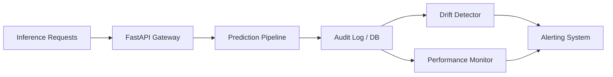
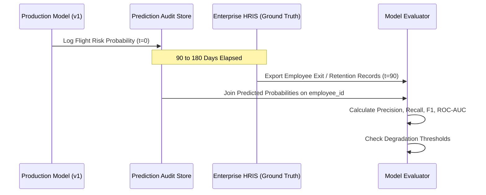

# Enterprise HR AI — Production Monitoring Strategy

This document outlines the end-to-end monitoring architecture for the Enterprise HR AI platform, covering data drift detection, prediction distribution tracking, ground-truth model degradation auditing, and infrastructure observability.

---

## 1. System Observability & Metrics

### Key Service Level Objectives (SLOs)
- **Inference Latency**: p95 < 50ms, p99 < 120ms
- **API Availability**: >= 99.9% uptime
- **Error Rate**: < 0.1% 5xx errors across all endpoints
- **Audit Completeness**: 100% of predictions logged to `data/predictions/predictions_log.csv`

---

## 2. Data Drift Monitoring

Data drift occurs when the statistical properties of incoming operational employee data diverge from the baseline dataset used during model training.

### Monitored Feature Distributions

| Feature | Baseline Distribution | Drift Detection Metric | Alert Threshold | Action Required |
|---|---|---|---|---|
| `Age` | Mean: 39.8, Std: 12.1 | Kolmogorov-Smirnov (KS) / PSI | $p < 0.05$ or $\text{PSI} > 0.20$ | Audit recruiting demographic shifts |
| `MonthlySalary` | Median: $72,500 | 2-Sample KS Test / PSI | $\text{PSI} > 0.25$ | Recalibrate salary compensation scale |
| `YearsAtCompany` | Mean: 5.4 years | Wasserstein Distance | $\Delta > 1.5\text{ years}$ | Evaluate tenure cohort composition |
| `WorkLifeBalanceScore` | Range: 1.0 - 5.0 | KS Test | $p < 0.01$ | HR Well-being audit |
| `OvertimeHoursPerMonth` | Mean: 18.2 hrs | KS Test / Mean Shift | Shift > 25% | Investigate department burnout spike |
| `CustomerSatisfaction` | Median: 7.0 | KS Test / Missing Rate Shift | Missing > 60% | Inspect CRM integration health |
| `Department` & `JobRole` | Categorical Frequencies | Chi-Square ($\chi^2$) Contingency | $p < 0.01$ | Update O*NET role taxonomy mapping |

### Drift Quantification Formulas

1. **Population Stability Index (PSI)**:
   $$\text{PSI} = \sum_{i=1}^{k} \left( \text{Actual}_i - \text{Expected}_i \right) \times \ln\left(\frac{\text{Actual}_i}{\text{Expected}_i}\right)$$
   - $\text{PSI} < 0.10$: Negligible shift; no intervention required.
   - $0.10 \le \text{PSI} \le 0.25$: Moderate drift; initiate scheduled review.
   - $\text{PSI} > 0.25$: Severe drift; trigger automated retraining pipeline.

---

## 3. Prediction Probability & Output Distribution Monitoring

Monitoring model outputs allows rapid detection of covariate shifts and anomalies prior to ground-truth feedback:

1. **Predicted Flight Risk Distribution**:
   - Baseline positive prediction rate: $\sim 11.0\%$ High Risk.
   - Alert Trigger: If the rolling 30-day high-risk rate shifts below $5\%$ or above $25\%$.
2. **Mean Predicted Probability**:
   - Baseline mean score: $0.11 \pm 0.03$.
   - Alert Trigger: 7-day moving average deviation $> 2\sigma$.

---

## 4. Ground-Truth Performance Monitoring (Delayed Feedback Loop)

Because employee attrition outcomes are observed over 3 to 12-month evaluation windows, performance evaluation operates on quarterly lagging cohorts:

### Performance Degradation Thresholds
- **Primary Metric (Recall)**: Baseline = $1.00$. Alert if Recall drops below $0.75$.
- **F1-Score**: Baseline = $1.00$. Alert if F1 drops below $0.70$.
- **ROC-AUC**: Baseline = $1.00$. Alert if ROC-AUC drops below $0.85$.

---

## 5. Incident Response & Escalation Protocol

1. **P3 - Low Severity** (Minor schema warning or mild PSI 0.10-0.20): Logged to dashboard; reviewed during bi-weekly maintenance.
2. **P2 - Medium Severity** (High missing values in satisfaction score or inference latency spike): Alert sent to ML Engineering on-call; inspect upstream data pipelines.
3. **P1 - High Severity** (Severe drift $\text{PSI} > 0.25$, service failure, or F1 drop below threshold): Automated failover to conservative risk heuristic rule-set and trigger automated retraining pipeline workflow.
