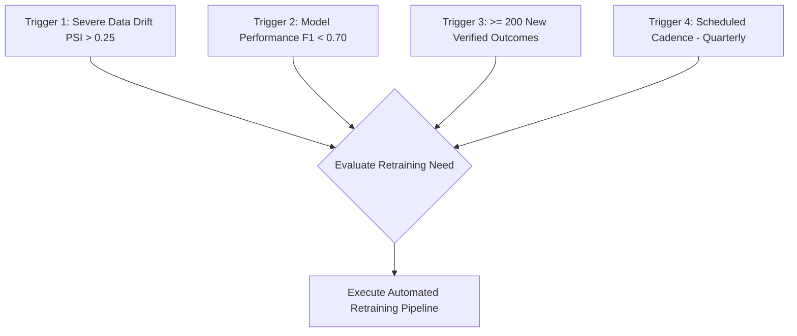
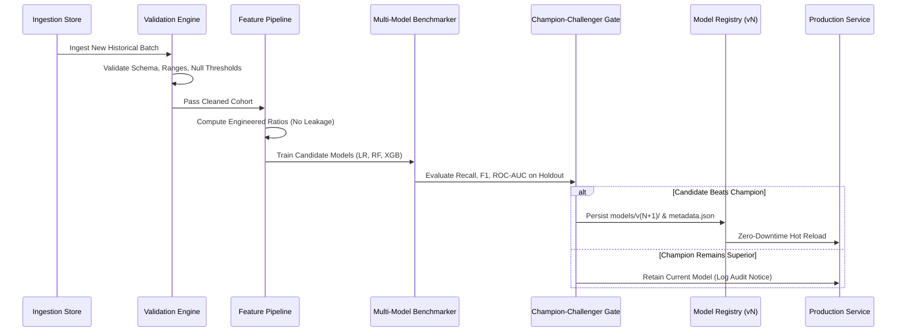

# Enterprise HR AI — Continuous Retraining Strategy

This document defines the lifecycle, governance, execution triggers, and deployment gates for retraining the machine learning models within the Enterprise HR AI platform.

---

## 1. Retraining Trigger Conditions

Retraining is governed by three primary trigger categories:

1. **Drift-Induced Retraining**:
   - Feature drift detected on key risk drivers (`MonthlySalary`, `YearsAtCompany`, `WorkLifeBalanceScore`) where $\text{PSI} > 0.25$ over a 30-day window.
2. **Performance Degradation**:
   - Historical evaluation indicates $F_1\text{-score} < 0.70$ or $\text{Recall} < 0.75$ on recent ground-truth exit cohorts.
3. **Data Accumulation Threshold**:
   - Acquisition of $\ge 200$ new labeled employee retention/departure records.
4. **Scheduled Maintenance Cadence**:
   - Quarterly automated model benchmark and refresh.

---

## 2. End-to-End Retraining Workflow

### Pipeline Steps:

1. **Data Ingestion & Integrity Validation**:
   - Verify non-empty primary keys, expected column types, and label validity.
   - Reject records with contradictory exit dates or corrupted salary values.

2. **Feature Transformation & Leakage Prevention**:
   - Execute exact domain feature engineering transformations (`income_per_year_at_company`, `promotion_gap_ratio`, `overtime_ratio`, `leave_utilization`, `work_life_satisfaction`).
   - Fit preprocessing transformations (`StandardScaler`, `OneHotEncoder`) strictly on the training partition.

3. **Multi-Model Benchmark**:
   - Train `LogisticRegression`, `RandomForestClassifier`, and `XGBClassifier` under identical stratified splits.
   - Optimize hyperparameters using 5-fold Stratified Cross-Validation prioritizing **Recall** and **F1-Score**.

4. **Champion vs. Challenger Gate**:
   - Challenger model must meet or exceed Champion performance:
     $$\text{Recall}_{\text{challenger}} \ge \text{Recall}_{\text{champion}} - 0.02 \quad \text{AND} \quad F1_{\text{challenger}} > F1_{\text{champion}}$$
   - Latency benchmark: Inference p95 must remain $< 50\text{ms}$.

5. **Model Versioning & Artifact Registration**:
   - Export pipeline binary to `models/v{N+1}/attrition_pipeline.joblib`.
   - Generate immutable `models/v{N+1}/metadata.json` documenting precise metrics, training date, hyperparameters, and feature schemas.
   - Log experiment runs and metrics to MLflow.

---

## 3. Rollback & Failover Strategy

If a newly deployed model exhibits anomalous behavior in production:

1. **Instant Rollback**:
   - The `ModelRegistry` supports hot-reloading previous stable versions (e.g. reverting `models/v2` to `models/v1`) without requiring service restarts.
2. **Heuristic Fallback**:
   - If model inference encounters an unhandled runtime error, the service falls back to a deterministic rule-based heuristic based on extreme overtime, satisfaction deficiency, and promotion stagnation.
